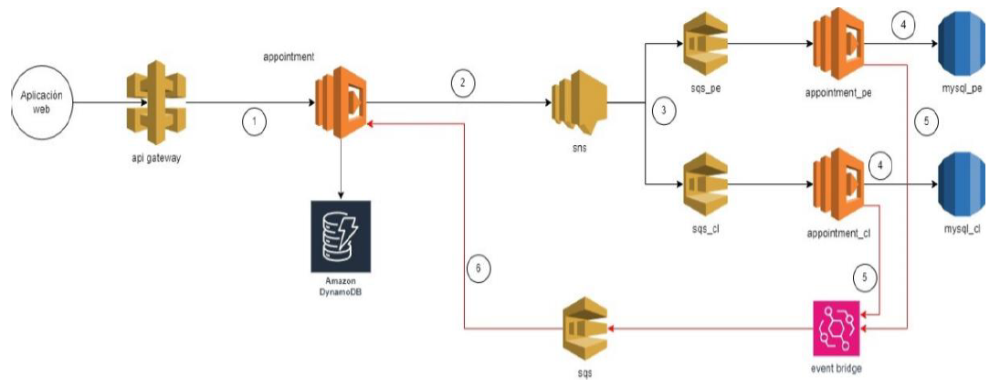

# Proyecto Reto

Aplicación de agendamiento de cita médica para asegurados

## Diagrama de arquitectura



### Payload para las tabla DynamoDB

Tiene como key schema la variable apptId. Como GSI (Global secundary index) la varibable insureId para poder obtener todas las citas relacionadas a esta variable

```json
{
  "apptId": "string",
  "insureId": 0,
  "scheduleId": "string",
  "countryISO": "string",
  "status": "string"
}
```
### Payload para las tablas SQL

Se considera que ambas tablas se encuentran en una misma base de datos y tiene lambdas separadas **appointment_cl** y **appointment_pe**. Estas lambdas guardan informacion en las tablas **mysql_pe** y **mysql_cl** respectivamente

```json
{
  "insureId": 0,
  "scheduleId": "string",
  "countryISO": "string",
}
```

